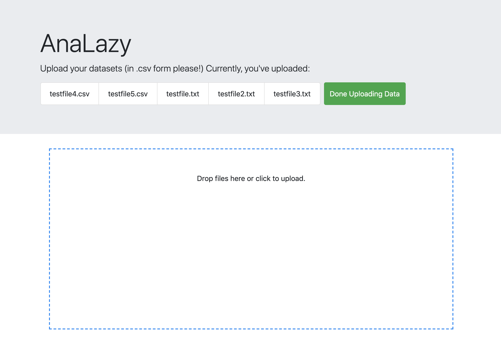
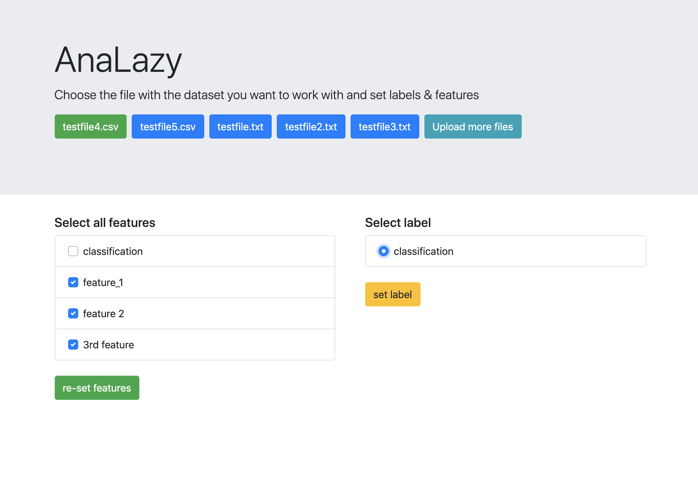
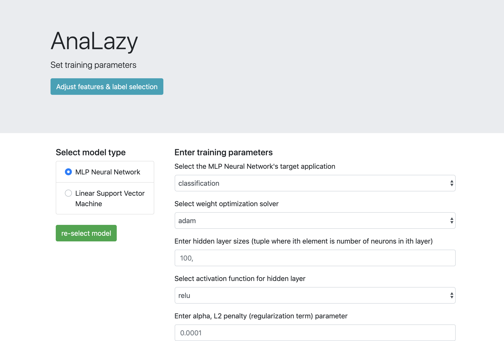
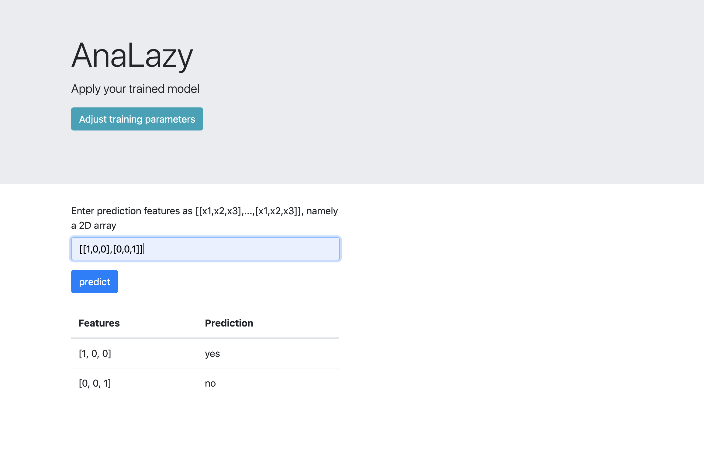

# AnaLazy

AnaLazy is a graphical web or desktop application which enables analysts to train a machine learning model off of a spreadsheet of training data and then make useful predictions, all without having to write a single line of code. 

## Installation

Download the code from the [GitHub repository](https://github.com/prathgan/AnaLazy) and install all dependencies

```bash
pip install -r requirements.txt
```

## Usage
### Running
Navigate in a terminal to the root of the folder with the AnaLazy app code.

To run AnaLazy in the standard configuration (GUI will automatically open)
```bash
python index.py
```

To run AnaLazy in the web configuration (webapp will automatically open in default browser)
```bash
python index.py web
```

To run AnaLazy in the debug web configuration (hot reloading, no automatic page opens on restart)
```bash
python index.py web debug
```
### Using





## Contributing
Pull requests are welcome. For major changes, please open an issue first to discuss what you would like to change.

## License
[MIT](https://choosealicense.com/licenses/mit/)